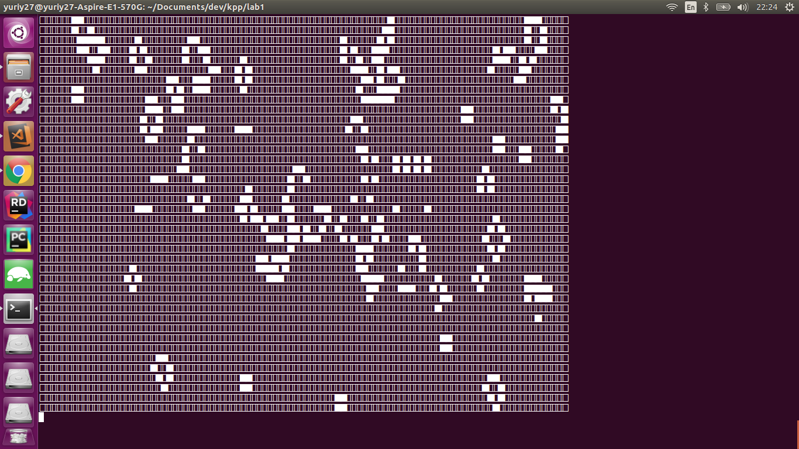

# kpp-lab1 (Game of life)

__Instructions:__
1. run in terminal `node index.js`
1. enter start configuration. First number n - number of live cells. Then n pairs (x, y) - coordinates of each cell. Example input: `5 5 5 6 5 7 5 7 4 6 3`. Here we define 5 points with coordinates (5,5), (6,5), (7,5), (7,4), (6,3). If you want randomize start configuration just type `rand`
1. enjoy 

